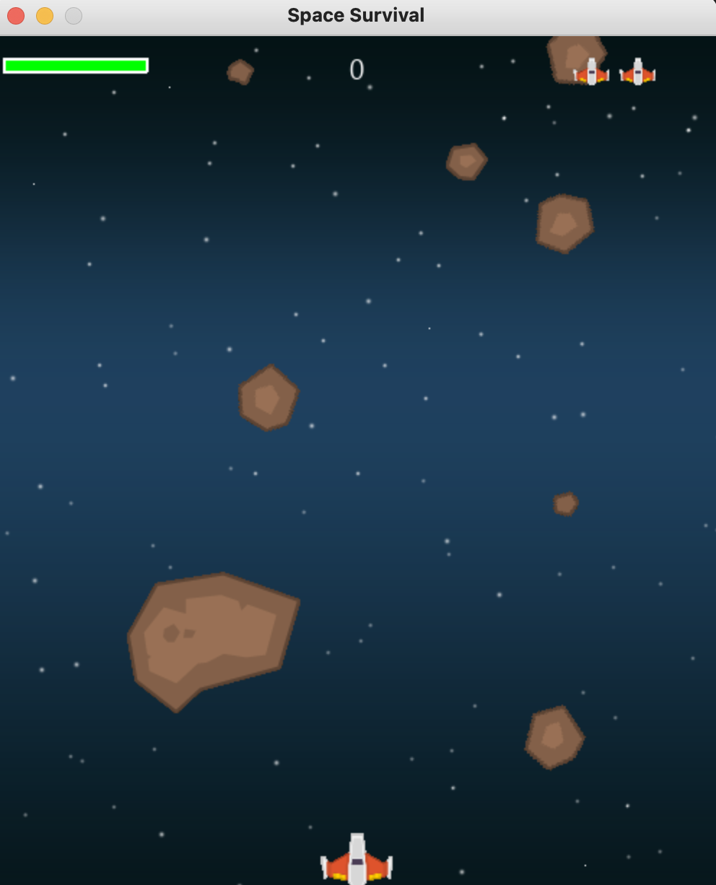
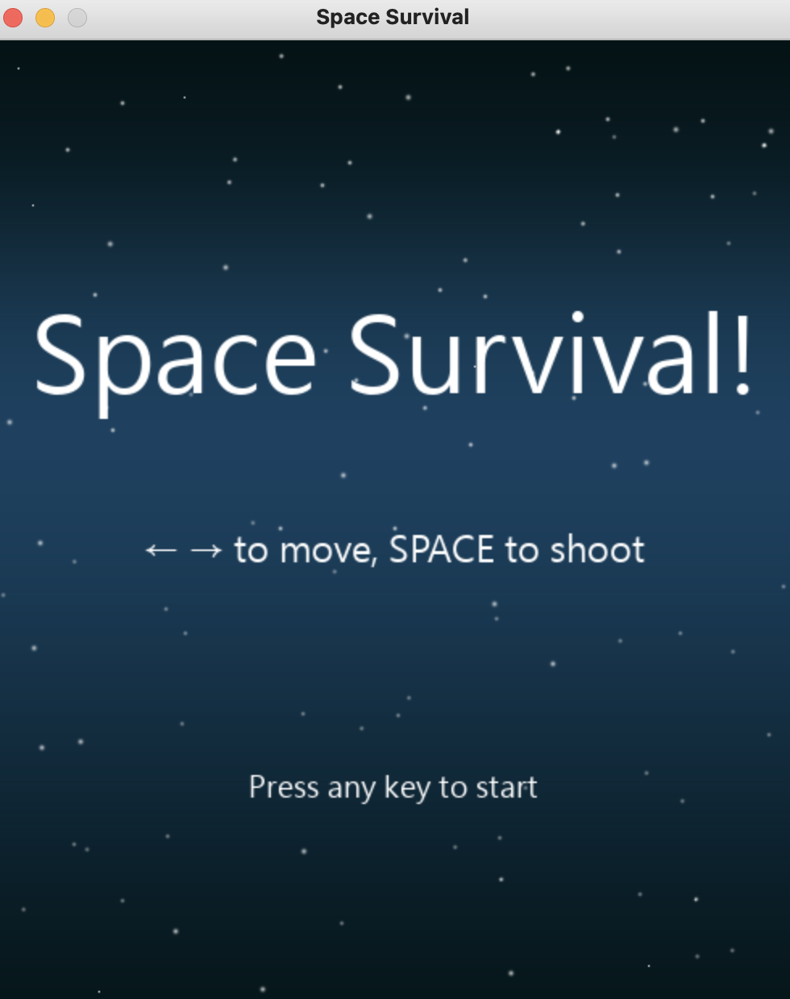

# Space Survival Game

`Space Survival Game` is a fun, arcade-style space shooter game built with Python and Pygame. The player controls a spaceship and tries to survive by dodging or destroying falling asteroids (rocks) while collecting power-ups and maintaining their health and lives.

 

## Table of Contents
- [Space Survival Game](#space-survival-game)
  - [Table of Contents](#table-of-contents)
  - [Features](#features)
  - [Game Controls](#game-controls)
  - [Game Mechanics](#game-mechanics)
  - [Requirements](#requirements)
  - [Installation](#installation)
  - [How to Play](#how-to-play)
  - [Screenshots](#screenshots)
  - [Future Development](#future-development)
  - [Contribution Guidelines](#contribution-guidelines)
  - [License](#license)
  - [Contact \& Feedback](#contact--feedback)

## Features
- **Spaceship Combat**: Control your spaceship to avoid and destroy falling asteroids.
- **Power-ups**: Collect power-ups like shields and weapon upgrades to survive longer.
- **Health and Lives**: Maintain your health and lives to keep playing as long as possible.
- **Explosions and Effects**: Visual explosion animations when asteroids are destroyed or the player is hit.
- **Dynamic Enemy Rocks**: Randomized movement, rotation, and speed of asteroids.
- **Interactive Menu**: Start the game with a simple, interactive menu interface.

## Game Controls
- **Move Left**: `Left Arrow Key`
- **Move Right**: `Right Arrow Key`
- **Shoot**: `Spacebar`

## Game Mechanics
1. **Rocks (Enemies)**: Randomized rocks fall from the top of the screen, and the player must avoid or shoot them to survive.
2. **Player Health**: The player starts with 100 health and can lose health if hit by rocks.
3. **Power-ups**:
   - **Shield**: Restores some health when collected.
   - **Gun Upgrade**: Increases the firepower, allowing the player to shoot more bullets.
4. **Explosions**: Rocks and player deaths trigger visual explosions for a satisfying effect.

## Requirements
- **Python 3.6 or newer**: Make sure you have Python installed on your machine.
- **Pygame**: The game uses the Pygame library for rendering and game mechanics.
  
To install Pygame, use:
```bash
pip install pygame
```

## Installation
1. **Clone the repository**:
   ```bash
   git clone https://github.com/Bowen12137/space-survival-game.git
   cd space-survival-game
   ```
2. **Prepare the assets**:
   Ensure you have the following folders and assets in the same directory:
   - **img/**: Contains the game images like `player.png`, `rockX.png`, `explX.png`, `background.png`, etc.
   - **sound/**: Contains the game sound effects like `shoot.wav`, `pow1.wav`, `expl0.wav`, `background.ogg`, etc.
   - **font.ttf**: Font file for displaying text in the game.

3. **Run the game**:
   After setting up, run the game by executing:
   ```bash
   python3 main.py
   ```

## How to Play
1. **Objective**: Survive as long as possible by dodging or destroying falling asteroids while collecting power-ups.
2. **Controls**: Use the arrow keys to move the spaceship left or right, and press the spacebar to shoot.
3. **Score**: Destroy rocks to earn points. The larger the rock, the more points you earn.
4. **Game Over**: The game ends when the player loses all lives.

## Screenshots




## Future Development
1. **Levels and Difficulty**: Implement progressive levels where the number and speed of asteroids increase over time.
2. **Boss Battles**: Add larger, more challenging enemies as boss fights.
3. **Multiplayer Mode**: Implement a co-op mode where two players can play on the same screen.
4. **More Power-ups**: Introduce new power-ups, such as speed boosts or temporary invincibility.
5. **Enhanced Visual Effects**: Improve explosion effects and animations for a more engaging experience.

## Contribution Guidelines
We welcome contributions to enhance the functionality of the `Space Survival Game`. Here's how you can contribute:

1. **Fork the repository**.
2. **Create a feature branch** for your feature or bug fix.
   ```bash
   git checkout -b feature/your-feature
   ```
3. **Make the necessary changes** and commit them.
   ```bash
   git commit -m "Add feature: your-feature"
   ```
4. **Push the changes** to your fork.
   ```bash
   git push origin feature/your-feature
   ```
5. **Submit a pull request** to merge your changes into the main repository.

For major changes, please open an issue first to discuss what you would like to change. Be sure to include tests where applicable.

## License
This project is licensed under the MIT License. See the [LICENSE](LICENSE) file for details.

## Contact & Feedback
We highly appreciate any feedback and suggestions. If you have questions or encounter issues, feel free to reach out via email:

✉️ **Email**: Arthur12137@gmail.com
